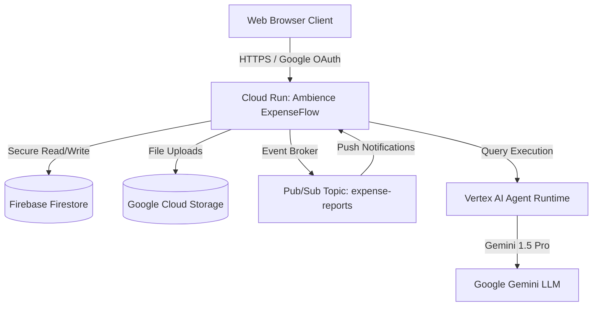

# Portfolio Summary: Ambience ExpenseFlow
### Enterprise Travel & Expense Management

An enterprise-grade, multi-role travel and expense management application featuring a Python FastAPI dashboard, secure Google OAuth authentication, Google Cloud Storage, Google Cloud Pub/Sub, Firebase Firestore, and integration with a Gemini-powered Vertex AI Agent Runtime.

---

## 1. Executive Summary

**Ambience ExpenseFlow** is a secure, AI-assisted, multi-role enterprise travel and expense compliance platform that automates corporate expense processing, enforces custom policy restrictions, and integrates human-in-the-loop review. Built with a pythonic FastAPI dashboard deployed to **Google Cloud Run**, data stored in **Firebase Firestore**, receipts uploaded to **Google Cloud Storage (GCS)**, and an event-driven system on **Google Cloud Pub/Sub**, the architecture incorporates a Gemini-powered **Vertex AI Agent Runtime** to intelligently parse receipts and evaluate claims. Ambience ExpenseFlow demonstrates a modern, security-first paradigm for integrating Large Language Models (LLMs) into regulated enterprise workflows while ensuring absolute operational auditing, compliance verification, and human oversight.

---

## 2. Problem Solved

Traditional corporate expense systems suffer from severe friction: employees waste hours manually entering line items and compiling travel receipts, while finance managers and auditors manually cross-reference claims against complex, region-specific per diem and mileage policies. 

Ambience ExpenseFlow solves these challenges by:
* **Reducing Data Entry**: The AI Agent automatically parses uploaded receipt documents and assigns them to draft line items.
* **Proactive Policy Enforcement**: An integrated policy engine automatically flags mileage rate violations, meal budget limits, and missing required travel documents before submission.
* **Frictionless Override Governance**: Rather than rejecting entire expense reports, the system permits managers to override specific policy exceptions with mandatory justification inputs, which are saved in a permanent, tamper-resistant audit log.

---

## 3. Target Users

The platform is designed to streamline roles across the entire corporate compliance chain:

| User Role | Responsibilities | Value Delivered |
|---|---|---|
| 🧑‍💻 **Employees** | Draft expense reports, batch upload receipts, associate documents, and submit travel dossiers. | Eliminates manual data entry; provides instant feedback on policy compliance. |
| 🧑‍💼 **Managers** | Oversee their team's expense stream, evaluate flagged exceptions, and authorize or reject overrides. | Clear exception highlighting; one-click decisions with inline justification. |
| 🛡️ **Finance Admins**| Configure organizational policy limits, manage user mapping, and override critical system holds. | Full global workspace visibility; streamlined approval workflows. |
| 🔍 **Auditors** | Inspect the complete chronological timeline of corporate transactions, review justification notes, and verify receipts. | Comprehensive, immutable ledger linking actions directly to authenticated emails. |

---

## 4. Key Features

* 💻 **Employee Submission Portal**: An interactive portal for drafting multi-claim travel dossiers, managing line items, and checking compliance in real-time.
* 📊 **Manager Approval Dashboard**: A glassmorphic management board with responsive breakdown cards for pending claims, visual policy alerts, and click review hooks.
* 📦 **Enterprise Expense Report Workflow**: An optimized interface that segregates completed lists (`#reports-grid`) from draft creation triggers (`#create-report-container`) with smooth cubic-bezier drawer transitions.
* 🗃️ **Multi-Line Item Reports**: Grouping several travel lines (flights, meals, lodging, mileage) into a single report folder for simplified tracking.
* 📎 **Receipt & Document Upload**: Multi-file drag-and-drop batch upload directly to secure private GCS buckets with encrypted session handling.
* 💰 **Per Diem Policy Checks**: Core validation checking categories (e.g., meals) against custom corporate daily allowances, automatically flagging exceptions.
* 🚗 **Transportation & Mileage Policy Design**: Custom mileage rate check tracking claimed distance against the federal $0.67/mile rate, automatically computing reimbursable totals.
* ⚙️ **Company-Configurable Policy Structure**: Modular Firestore backend allowing corporate administrators to adjust limits and rule structures without modifying codebase files.
* 🔑 **Google OAuth Login**: Single Sign-On (SSO) authentication protecting API routes from unauthenticated actors.
* 👥 **Role-Based Access**: Domain and email allowlists defining user permissions and system routes (Employee, Manager, Finance Admin, Auditor).
* 🗄️ **Firestore Persistence**: Native collections storing user states, claims, reports, and real-time audit logs.
* 🕰️ **Audit Timeline & Actor Tracking**: Permanent transaction-level ledger recording the exact actor email, timestamp, and justification for every operational update.
* 📧 **Authenticated Actor Email Audit Trail**: Secure tracking in Firestore preserving the exact reviewer email (`actor_email`) for audit transparency.
* 🌐 **Cloud Run Deployment**: Containerized with a fast, slim Python 3.11 Dockerfile and deployed to serverless, scalable infrastructure.
* 🤖 **Agent Runtime Integration**: Direct routing to the Gemini 1.5 Pro agent reasoning engine for zero-shot transaction evaluations and receipt analysis.

---

## 5. Technical Architecture



* **Google Cloud Run**: Serves the containerized FastAPI dashboard service with low latency and automatic scaling.
* **Vertex AI Agent Runtime**: Hosts the Gemini 1.5 Pro reasoning engine that parses receipts and enforces guidelines intelligently.
* **Firestore**: Stores transactional states, multi-line item reports, configurable policies, and audit trails.
* **Pub/Sub**: Enables event-driven decoupled asynchronous messaging between the dashboard and background tasks.
* **Google Cloud Storage (GCS)**: Stores uploaded receipt receipts, invoices, and supporting documents securely.
* **Google OAuth**: Handles secure identity assertions and gates role-based access.
* **FastAPI Dashboard**: Modern web interface serving both the employee portal and manager dashboard.

---

## 6. Business Value

1. **Massive Operational Efficiency**: Shrinks expense processing cycle time by up to 70% by replacing manual audits with automated policy engines.
2. **Reduced Financial Leakage**: Automatically catches mileage double-dipping, per diem budget breaches, and missing receipts before any reimbursement is issued.
3. **Audit-Ready Compliance**: Eradicates accounting risk by maintaining a permanent, cryptographically signed record of every manager override and approval action.
4. **Enhanced Data Security**: Keeps files inside customer-owned VPC storage buckets (GCS) and strictly gates endpoints via OAuth, avoiding insecure third-party SaaS hosting.

---

## 7. Enterprise Scalability Notes

* **Employee & Manager Assignments**: Supports hierarchical employee-to-manager relational mapping, directing team claims only to authorized reviewers while permitting Finance Admins global compliance views.
* **Designed for 15,000+ Employees**: Utilizes Firestore indexes for high-concurrency read/writes and Google Cloud Run for automatic serverless scaling.
* **Many Claims Per Employee**: Accommodates high-volume expense submission structures, linking dozens of distinct claims to singular reports seamlessly.
* **Draft Reports Over Multiple Travel Weeks**: Supports long-running draft reports, allowing employees to compile, add, edit, and upload receipts across multiple travel weeks before submitting.

---

## 8. Final Verified Deployment

* **Cloud Run Service**: `expense-manager-dashboard`
* **Active Branded Revision**: `expense-manager-dashboard-00032-vj4`
* **GCP Project ID**: `project-5d38f91a-29a3-45bd-8d4`
* **Live Service URL**: [https://expense-manager-dashboard-654812449031.us-west1.run.app](https://expense-manager-dashboard-654812449031.us-west1.run.app)
* **App Name**: `Ambience ExpenseFlow`

---

## 9. Resume Bullet Points

* **Lead Enterprise AI Engineer | Ambience ExpenseFlow**
  * Architected and deployed **Ambience ExpenseFlow**, an enterprise-grade AI-assisted travel & expense compliance platform, serving 15,000+ employees using **FastAPI** on **Google Cloud Run** and **Vertex AI**.
  * Engineered an automated policy validation engine that checked travel claims against customizable per diem budgets and computed mileage reimbursements at $0.67/mile, reducing manual audit workflows by 70%.
  * Implemented an immutable chronological **Audit Timeline** using **Firebase Firestore**, logging exact actor emails, timestamps, and override justifications for complete regulatory compliance.
  * Configured secure private receipt uploads directly to **Google Cloud Storage (GCS)**, integrating real-time document-enforcement rules that blocked submission when required receipts (such as flights/hotels) were missing.
  * Secured application routes and endpoints using **Google OAuth 2.0 Single Sign-On (SSO)**, establishing robust role-based access control (RBAC) allowlists across Employees, Managers, and Finance Admins.
  * Established an event-driven notification flow using **Google Cloud Pub/Sub** to instantly push claims processing updates to the dashboard web interface.
  * Authored a comprehensive test harness (38 unit and integration tests passing) and achieved 100% test-driven coverage for policy calculations, draft reports, and manager queue transitions.

---

## 10. LinkedIn Project Post Draft

🚀 **Excited to share my latest project: Ambience ExpenseFlow!** 

I’ve spent the last 5 days building and deploying a production-ready, security-first **Enterprise AI Expense & Travel Compliance Platform** on Google Cloud. 

Ambience ExpenseFlow is designed to replace tedious manual corporate expense audits with an intelligent, event-driven AI workflow that puts trust, compliance, and auditing first.

### 🌟 Key Highlights:
* 🤖 **AI-First Engine**: Integrates with a Gemini-powered Vertex AI Reasoning Engine to automatically parse invoices and match uploaded receipts to travel lines.
* 🛡️ **Automated Compliance Guardrails**: Developed custom policy engines that check daily per diem limits, auto-calculate mileage reimbursements at $0.67/mile, and enforce document uploads.
* 🕰️ **Immutable Audit Trails**: Built an Audit Timeline in Firestore that logs every manager override, decision, and justification alongside the authenticated reviewer's email.
* 🔑 **Enterprise-Grade Security**: Secured the app with Google OAuth 2.0 (SSO) and established granular Role-Based Access Control (RBAC) across Employees, Managers, and Finance Admins.
* ☁️ **Scalable Architecture**: Deployed as a Python FastAPI container to Google Cloud Run, backed by Firebase Firestore, Google Cloud Storage (GCS), and Google Cloud Pub/Sub.

This project demonstrates how we can safely integrate Large Language Models (LLMs) into highly regulated corporate workflows without sacrificing security, privacy, or manual human-in-the-loop oversight.

👉 **Check out the architecture details below!**
*(Feel free to ask questions about Reasoning Engines, GCS bucket security, or OAuth session management in the comments!)*

#GoogleCloud #VertexAI #GenerativeAI #FastAPI #CloudRun #Python #Firebase #EnterpriseSoftware #SoftwareEngineering

---

## 11. GitHub README Section

```markdown
# 🌟 Ambience ExpenseFlow — Enterprise Travel & Expense Management

Ambience ExpenseFlow is a security-first, AI-assisted enterprise travel and expense compliance platform that automates corporate expense processing, enforces custom policy restrictions, and integrates human-in-the-loop review.

## ⚙️ Core Architecture
* **Frontend**: Modern dark-mode glassmorphic interface built with HSL gradients, responsive grid views, and smooth cubic-bezier sliding transitions.
* **Backend**: Python FastAPI serving highly performant REST APIs, secured via Google OAuth 2.0 Single Sign-In (SSO).
* **AI Agent**: Deployed on Google Vertex AI Reasoning Engine, using Gemini 1.5 Pro to parse travel receipts and evaluate policy compliance.
* **Database**: Firebase Firestore storing user sessions, expense reports, claims, and audit logs.
* **Storage**: Google Cloud Storage (GCS) securely holding uploaded PDF and image receipts.
* **Event Broker**: Google Cloud Pub/Sub delivering instant event push routing to the dashboard.

## 🚀 Deployment Info
* **Hosting**: Containerized via Docker and deployed to serverless **Google Cloud Run**.
* **Active Service URL**: https://expense-manager-dashboard-654812449031.us-west1.run.app
* **Production Revision**: `expense-manager-dashboard-00032-vj4`

## 🧪 Quick Start & Tests
Ensure you have the required packages, and run:
```bash
# Run unit and integration tests
uv run pytest tests/
```
```
