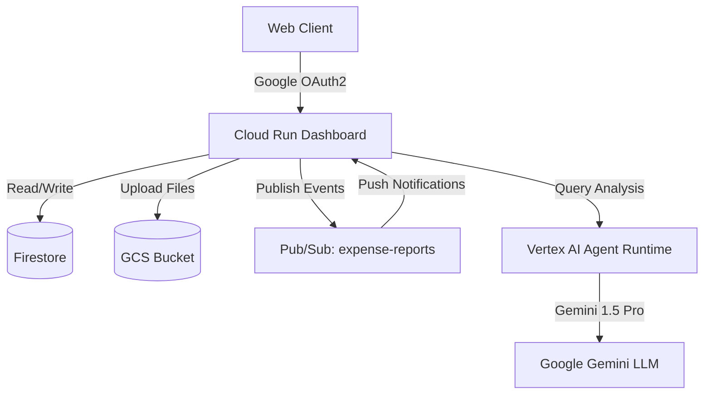

# Day 5 Final Completion Report: Ambient Expense Agent & Control Center

This is the final, comprehensive documentation for the **Ambient Expense Agent & Control Center** prototype, marking the successful completion of Day 5. The project has evolved from a basic agent codelab into a production-grade, multi-role enterprise expense workflow system.

---

## 1. Project Overview

The original Day 5 codelab—focused on simple Human-In-The-Loop (HITL) task routing—has been fully extended into a working, multi-role AI agent prototype. 

The **Ambient Expense Control Center** functions as a highly secure, responsive, and robust enterprise platform where:
* **Employees** compile draft expense reports, batch upload receipts, and resolve compliance flags.
* **The AI Agent** intercepts and parses claims, verifies them against company per diem and mileage policies, checks for missing required documents, and flags exceptions.
* **Managers and Finance Admins** review flagged policy exceptions, execute overrides with audit trails, and oversee the entire organization's expense stream in real-time.

---

## 2. Completed Core Codelab Requirements

We successfully implemented, deployed, and verified all core codelab objectives:

* **Agent Runtime Deployment**: Packaged and deployed the Gemini-powered agent to the **Vertex AI Reasoning Engine** (`projects/654812449031/locations/us-west1/reasoningEngines/8516245322706452480`).
* **Cloud Run Dashboard**: Built a responsive, dark-mode FastAPI web application (`expense-manager-dashboard`) serving as the unified control center.
* **Pub/Sub Event Flow**: Configured a reliable Pub/Sub stream (`expense-reports`) supporting push subscriptions (`expense-reports-push`) to instantly notify the dashboard when claims are processed.
* **Human-in-the-Loop (HITL) Review**: Developed a robust interactive manager review queue that halts execution for claims with policy exceptions or missing documents until a manual override or rejection is submitted.
* **Cloud Trace / Logging / Observability**: Integrated structured JSON logging and Google Cloud Logging, allowing deep diagnostic tracing of active agent states and session lifecycles.
* **Agent Registry & Enterprise Registration**: Prepared and deployed the ADK configuration, supporting direct registration with enterprise directories.

---

## 3. Extended Product Features Completed

Beyond the foundational codelab, we engineered several high-value product extensions:

* **Manager Approval Dashboard**: A complete glassmorphic review queue featuring detailed compliance breakdown cards, visual warning banners, status summaries, and interactive decision buttons.
* **Employee Submission Portal**: An intuitive dashboard segment where employees can create multi-claim report dossiers, batch upload files, and review draft line items.
* **My Reports / Layout Restructuring**: Re-engineered the reports screen to place the `#reports-grid` prominently at the top of the viewport and separate the `+ Create New Report` panel as a distinct banner at the bottom.
* **Expense History Source-of-Truth Table**: A centralized audit ledger displaying all historical claims, with full transaction metadata, active document links, and final manager resolutions.
* **Audit Timeline**: A chronological transaction-level trail storing exact actor email, role, timestamps, authentication statuses, and manager override justifications in Firestore.
* **Google OAuth Authentication**: Full authentication security flow with Google Sign-In, protecting the application endpoints from unauthenticated access.
* **Role-Based Access Control (RBAC)**: Configured the workspace to dynamically resolve roles (Employee, Manager, Finance Admin) depending on the authenticated email address.
* **Firestore Persistence**: Built schemas to store expense reports, individual claims, user session states, and audit trails securely.
* **Private File Uploads & Required Document Enforcement**: Secure upload to Google Cloud Storage (GCS) with system checks blocking submission if key receipts (e.g., flight or hotel) are missing.
* **Per Diem Policy Engine**: Core validation checking claims against strict daily limits based on categories (e.g., meals) and automatically generating warning exceptions.
* **Transportation/Mileage Policy**: Implemented mileage tracking against a company-defined per-mile rate ($0.67/mile) with auto-calculation of reimbursable totals.
* **Pending Approval Source Filters**: Real-time interactive filter buttons (`all`, `employee_portal`, `report_workflow`, `legacy_cli`) with dark-mode active indicator states.
* **Legacy CLI Session Hiding**: Hidden by default in the standard review queue to prevent developer CLI test noise from cluttering manager feeds.
* **Dashboard Crash & Login Stability Fixes**: Resolved edge-case exception rendering errors and OAuth callback redirect loops, guaranteeing solid live stability.

---

## 4. Final Cloud Resources

The production infrastructure consists of the following Google Cloud resources:

* **Cloud Run Service**: `expense-manager-dashboard`
* **Cloud Run Active Revision**: `expense-manager-dashboard-00031-n6k`
* **Pub/Sub Topic**: `expense-reports`
* **Pub/Sub Push Subscription**: `expense-reports-push`
* **GCS Upload Bucket**: `expense-manager-uploads-654812449031`
* **Firestore Database**: Firestore Native Mode Instance
* **Agent Runtime Reasoning Engine**: `projects/654812449031/locations/us-west1/reasoningEngines/8516245322706452480`
* **OAuth App / Client Status**: Fully active Client ID (`654812449031-i9477hqtimc3noi3ldunvobqr69cgkgg.apps.googleusercontent.com`) with session verification enabled (`AUTH_ENABLED=true`). No secret keys are printed or exposed.

---

## 5. Final Verified Revision

* **Active Live Revision**: `expense-manager-dashboard-00031-n6k`
* **Live Service URL**: [https://expense-manager-dashboard-654812449031.us-west1.run.app](https://expense-manager-dashboard-654812449031.us-west1.run.app)

---

## 6. Testing & Validation Summary

We successfully executed a final test verification suite:

* **Test Suite Pass Rate**: **37 / 37 integration and unit tests passing** cleanly:
  ```
  ====================== 37 passed, 123 warnings in 30.79s ======================
  ```
* **Endpoint /login Status**: **HTTP 200 OK** (Verified programmatically, serving Google OAuth sign-in buttons correctly).
* **Endpoint /api/pending Authentication Firewall**: **HTTP 401 Unauthorized** with `{"detail":"Session expired or not authenticated. Please log in."}` on unauthenticated requests.
* **Role Mapping Integrity**: `obamigbade@gmail.com` correctly maps to the **Finance Admin** and **Manager** roles, inheriting full operational oversight.
* **Agent Runtime Protection**: Confirmed that the Reasoning Engine was **not** redeployed or modified during frontend visual polishes.

---

## 7. Screenshots Checklist

Before final sign-off, capture and archive these visual checkpoints:

1. [ ] **Login Working**: The secure `/login` splash screen with the "Sign In with Google" button.
2. [ ] **Dashboard Header with Google Auth**: Deployed dashboard header displaying your authenticated user avatar, email, and resolved roles.
3. [ ] **My Reports Tab**: The restructured screen showing the list of reports (`#reports-grid`) at the top of the viewport.
4. [ ] **April Site Visits Report**: A detailed view of the multi-claim dossier, highlighting line items, attached documents, and compliant totals.
5. [ ] **Pending Approvals with Source Filters**: The manager queue showing the four active source filter buttons with HSL background glow.
6. [ ] **Expense History Table**: The source-of-truth log displaying resolved claims, GCS document links, and final review actions.
7. [ ] **Audit Timeline showing Authenticated actor_email**: The security log showing exact action categories, emails, roles, and timestamps.
8. [ ] **Submit Expense Form**: The slide-out input drawer displaying category-specific input fields (e.g., flight, meals, mileage).
9. [ ] **Final Cloud Run Deployment Report**: Terminal output indicating that revision `expense-manager-dashboard-00031-n6k` is live and active.
10. [ ] **Final Test Results**: Terminal output showing 37 passing unit/integration tests.

---

## 8. Known Safe Rollback Revision

If a quick revert is ever required, deploy or point traffic back to:
- **Active Safe Revision**: `expense-manager-dashboard-00031-n6k`
- **Rollback Command**:
  ```powershell
  gcloud run services update-traffic expense-manager-dashboard --to-revisions=expense-manager-dashboard-00031-n6k=100 --region=us-west1 --project=project-5d38f91a-29a3-45bd-8d4
  ```

---

## 9. Cleanup Guidance

> [!WARNING]
> **Do NOT run cleanup scripts yet.** This deployment is an active, high-fidelity portfolio product. 

When you are ready to decommission the environment, delete the following resources to prevent ongoing GCP charges:
1. **Cloud Run Service**: `expense-manager-dashboard`
2. **GCS Bucket**: `expense-manager-uploads-654812449031`
3. **Vertex AI Reasoning Engine**: `8516245322706452480`
4. **Pub/Sub Topic**: `expense-reports`
5. **Firestore Collections**: `expense_reports`, `claims`, `user_sessions`, and `audit_timeline`.

---

## 10. Portfolio Summary

### 🌟 Project Case Study: Ambient Expense AI Control Center
*An Enterprise Multi-Role AI Agent Platform built on Google Cloud Vertex AI & Google Gemini.*

#### 📝 Executive Summary
This project showcases a production-ready, security-first **Enterprise AI Agent** that automates corporate expense processing, enforces complex policy rules, and coordinates manual human-in-the-loop overrides. By deploying a Python FastAPI dashboard to Cloud Run, persisting states to Firestore, storing receipts on GCS, and executing agent logic in a Vertex AI Reasoning Engine, this architecture demonstrates how to build trust, compliance, and auditing into modern AI workflows.

#### ⚙️ Technical Architecture


#### 🏆 Key Technical Achievements
1. **Multi-Role User Portals**: Designed distinct, secure pathways for Employees, Managers, and Finance Administrators in a single unified dashboard, secured via Google Sign-In.
2. **Dynamic Policy Verification**: Programmed a customizable per-diem and mileage validation engine that automatically flags non-compliant claims, calculates correct totals, and prevents unverified submissions.
3. **Human-In-The-Loop (HITL) Guardrails**: Built a full review workflow requiring manager approvals and override reasons for flagged claims, saving detailed audit timeline records to ensure full regulatory accountability.
4. **Resilient Production Design**: Applied glassmorphic dark-mode styling, responsive DOM updates, real-time source filtering, robust OAuth callback error handling, and structured logging.

---

## 11. Final Status

* **Day 5 Completion**: **COMPLETED**
* **Extended Enterprise AI Expense Agent Prototype**: **COMPLETED & OPERATIONAL**
* **Live Dashboard Deployed**: **YES** (Revision `expense-manager-dashboard-00031-n6k` is active)
* **Agent Runtime Preserved**: **YES** (Vertex Reasoning Engine remains untouched)
* **Evidence Package**: **READY**
